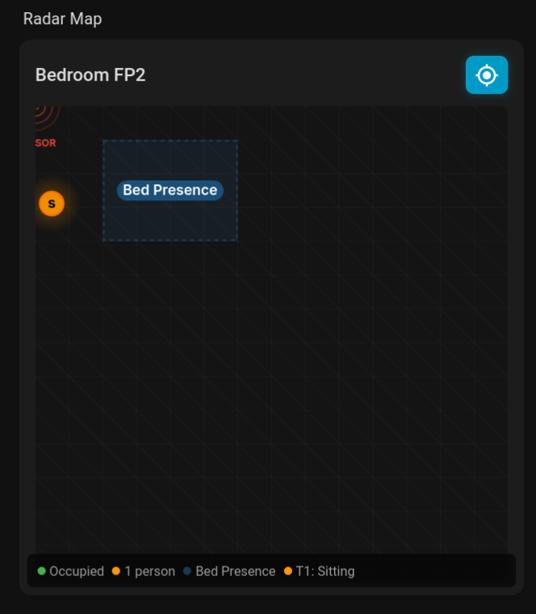
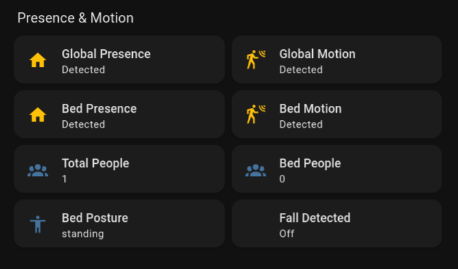
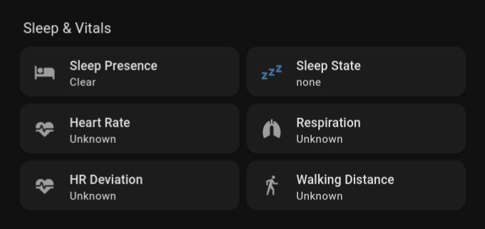
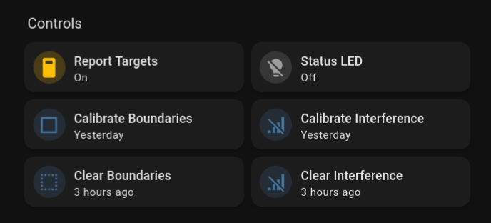
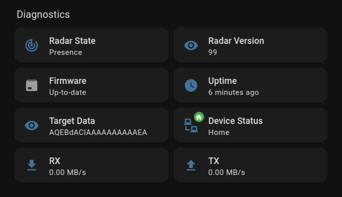

# esphome_fp2_ng

Custom ESPHome firmware for the Aqara FP2 Presence Sensor with full feature extraction: per-zone people counting, sleep monitoring, fall detection, posture tracking, and factory-calibrated light sensing.

Forked from [hansihe/esphome_fp2](https://github.com/hansihe/esphome_fp2) with extensive bug fixes, new features, and comprehensive reverse engineering documentation.



| | |
|---|---|
|  |  |
|  |  |

## What This Does

Replaces the stock ESP32 firmware on the Aqara FP2 with ESPHome, while keeping the TI IWR6843AOP radar firmware intact. This gives you **local-only** access to data that Aqara normally locks behind HomeKit and their cloud:

- **Per-zone people counting** — native radar counting (SubID 0x0175), not position approximation
- **Global people count** — total detected persons
- **Sleep monitoring** — heart rate, respiration rate, heart rate deviation
- **Fall detection** — binary sensor for fall events
- **Posture tracking** — per-zone standing/sitting/lying detection
- **Walking distance** — cumulative distance sensor
- **Real-time target tracking** — individual target positions with configurable publish rate
- **Zone presence and motion** — per-zone binary sensors with presence inference
- **Factory-calibrated light sensor** — OPT3001 with per-unit NVS calibration
- **Accelerometer corrections** — factory calibration from NVS
- **Radar firmware OTA** — XMODEM-1K update mechanism (experimental)
- **Auto-calibration** — room boundary and interference detection buttons

All data stays local. No Aqara cloud dependency.

## Changes from Upstream

See [docs/06-changelog.md](docs/06-changelog.md) for the original changelog.

**Bug fixes:**
- Switch fall-through in report handler (malformed packets misinterpreted)
- Null pointer crashes when global zone sensors not configured
- ESP-IDF 5.5+ compilation error (`driver/i2c.h` removed)
- Wall mounting mode broken in Lovelace card
- PI constant typo in accelerometer
- Presence detection state interpretation (0=empty, non-zero=occupied)
- Zone presence inference from motion/people count (0x0142 may not fire on boot)
- Stale sensor states cleared on presence-off cascade (sleep, people count, posture)
- Location reporting always enabled at radar level (people counting dependency)
- **All three grids (edge, interference, exit) always sent during init** — radar silently suppresses presence/motion reports if any grid is missing
- Double-init at 45 seconds — radar ACKs commands during boot but doesn't apply them

**New features:**
- Global people count sensor
- Per-zone native people counting (SubID 0x0175)
- Per-zone posture tracking (standing/sitting/lying)
- Fall detection via 0x0155 PEOPLE_COUNTING (Ghidra-confirmed source)
- Sleep monitoring: state, presence, heart rate, respiration, heart rate deviation
- Walking distance sensor
- Radar state diagnostic sensor (Booting/Init sent/Re-init/Ready/Presence)
- OPT3001 ambient light with factory NVS calibration
- Accelerometer factory NVS corrections
- Configurable target tracking publish rate (default 500ms)
- Radar firmware OTA via XMODEM-1K (experimental)
- Data-bearing RESPONSE frame routing (fixes missing zone reports)
- Improved Lovelace card: throttled updates, posture-aware targets, auto-tracking

**Reverse engineering:**
- Complete UART protocol spec with 43+ SubIDs documented
- SubID 0x0203 zone config sync mechanism (fully traced)
- SubID 0x0155 PEOPLE_COUNTING blob structure (7 bytes: zone, count, ontime)
- Fall detection path: radar FUN_00015624 sends 0x0155, not 0x0121
- Radar OTA XMODEM-1K protocol (all parameters, function addresses)
- NVS lux calibration algorithm (two-range piecewise linear)
- Handler registration table (139 entries, 32 bytes each)
- Stock firmware init sequence and radar boot timing

## Quick Start

### 1. Flash the FP2

See [FLASHING.md](FLASHING.md) for hardware disassembly, wiring, and backup instructions.

> **Important:** Back up the full flash before flashing ESPHome. The stock flash
> contains factory calibration data and radar firmware that cannot be recovered.

### 2. ESPHome Configuration

```yaml
esphome:
  name: fp2-bedroom
  on_boot:
    priority: 600
    then:
      - delay: 2s

esp32:
  board: esp32-solo1
  framework:
    type: esp-idf
    sdkconfig_options:
      CONFIG_FREERTOS_UNICORE: "y"
      CONFIG_ESP_SYSTEM_SINGLE_CORE_MODE: "y"
    advanced:
      ignore_efuse_mac_crc: true
      ignore_efuse_custom_mac: true

wifi:
  ssid: !secret wifi_ssid
  password: !secret wifi_password
  power_save_mode: light

api:
  encryption:
    key: !secret api_encryption_key
  actions:
    - action: get_map_config
      supports_response: only
      then:
        - api.respond:
            data: !lambda |-
              id(fp2).json_get_map_data(root);

ota:
  - platform: esphome
    password: !secret ota_password

logger:

uart:
  id: uart_bus
  tx_pin: GPIO19
  rx_pin: GPIO18
  baud_rate: 890000

external_components:
  - source: github://JameZUK/esphome_fp2_ng@main
    refresh: 120s
    components: [ aqara_fp2, aqara_fp2_accel ]

aqara_fp2_accel:
  id: fp2_accel
  light_sensor:
    name: "Ambient Light"

aqara_fp2:
  id: fp2
  accel: fp2_accel
  uart_id: uart_bus
  radar_reset_pin: GPIO13
  mounting_position: left_corner  # wall | left_corner | right_corner

  # Global sensors
  people_count:
    name: "Total People"
  fall_detection:
    name: "Fall Detected"
  radar_temperature:
    name: "Radar Temperature"
  radar_software_version:
    name: "Radar Version"
  radar_state:
    name: "Radar State"

  # Sleep monitoring
  sleep_state:
    name: "Sleep State"
  sleep_presence:
    name: "Sleep Presence"
  heart_rate:
    name: "Heart Rate"
  respiration_rate:
    name: "Respiration Rate"
  heart_rate_deviation:
    name: "Heart Rate Deviation"

  # Walking distance
  walking_distance:
    name: "Walking Distance"

  # Target tracking (throttled to 2Hz by default)
  target_tracking:
    name: "Targets"
  target_tracking_interval: 500ms
  location_report_switch:
    name: "Report Targets"

  # Auto-calibration
  calibrate_edge:
    name: "Calibrate Room Boundaries"
  calibrate_interference:
    name: "Calibrate Interference"
  clear_edge:
    name: "Clear Room Boundaries"
  clear_interference:
    name: "Clear Interference"

  # Global presence/motion
  global_zone:
    presence_sensitivity: medium  # low | medium | high
    presence:
      name: "Global Presence"
    motion:
      name: "Global Motion"

  # Detection zones
  zones:
    - id: bed_zone
      grid: |-
        ..............
        ..............
        ..............
        ..XXXXXXXX....
        ..XXXXXXXX....
        ..XXXXXXXX....
        ..XXXXXXXX....
        ..XXXXXXXX....
        ..............
        ..............
        ..............
        ..............
        ..............
        ..............
      presence_sensitivity: high
      presence:
        name: "Bed Presence"
      motion:
        name: "Bed Motion"
      zone_people_count:
        name: "Bed People Count"
      posture:
        name: "Bed Posture"

binary_sensor:
  - platform: gpio
    pin:
      number: GPIO36
      inverted: true
    name: "Device Button"

light:
  - platform: status_led
    name: "Status LED"
    pin:
      number: GPIO27
      inverted: true
```

### 3. Lovelace Card (Optional)

Install via HACS:
1. HACS > Frontend > Custom repositories
2. Add `https://github.com/JameZUK/esphome_fp2_ng`, category: Dashboard
3. Install and restart HA

Add to a dashboard:
```yaml
type: custom:aqara-fp2-card
entity_prefix: sensor.fp2_bedroom
title: Bedroom FP2
auto_tracking: true     # Auto-enable target tracking when card loads (default: false)
display_mode: full      # full | zoomed (default: full)
show_grid: true         # Show grid lines (default: true)
show_sensor_position: true  # Show sensor marker (default: true)
show_zone_labels: true  # Show zone labels (default: true)
```

## Exposed Entities

### Global

| Config Key | Type | Description |
|------------|------|-------------|
| `people_count` | sensor | Total detected person count |
| `fall_detection` | binary_sensor | Fall detected (via 0x0155 PEOPLE_COUNTING) |
| `radar_state` | text_sensor | Radar boot state: Booting / Init sent / Re-init / Ready / Presence |
| `sleep_state` | text_sensor | none / awake / light / deep |
| `sleep_presence` | binary_sensor | Sleep zone occupancy |
| `heart_rate` | sensor (bpm) | Heart rate from sleep monitoring |
| `respiration_rate` | sensor (br/min) | Respiration rate from sleep monitoring |
| `heart_rate_deviation` | sensor (bpm) | Heart rate deviation/variability from sleep monitoring |
| `walking_distance` | sensor (m) | Cumulative walking distance |
| `global_zone.presence` | binary_sensor | Overall presence (0=empty, non-zero=occupied) |
| `global_zone.motion` | binary_sensor | Overall motion (even=active, odd=inactive) |
| `target_tracking` | text_sensor | Base64 target data (diagnostic) |
| `target_tracking_interval` | config | Publish rate, default 500ms |
| `location_report_switch` | switch | Show/hide target data in HA |
| `calibrate_edge` | button | Trigger room boundary auto-calibration |
| `calibrate_interference` | button | Trigger interference auto-calibration |
| `clear_edge` | button | Clear/reset room boundary calibration |
| `clear_interference` | button | Clear/reset interference calibration |
| `radar_temperature` | sensor | Radar chip temperature (diagnostic) |
| `radar_software_version` | text_sensor | Radar firmware build number |

### Per Zone

| Config Key | Type | Description |
|------------|------|-------------|
| `presence` | binary_sensor | Zone occupancy (inferred from motion + people count) |
| `motion` | binary_sensor | Zone motion (even=active, odd=inactive) |
| `zone_people_count` | sensor | Native per-zone people count from radar |
| `posture` | text_sensor | none / standing / sitting / lying |

### Accelerometer / Light Sensor

| Config Key | Type | Description |
|------------|------|-------------|
| `light_sensor` | sensor (lux) | OPT3001 ambient light with factory NVS calibration |

### Radar Firmware OTA (EXPERIMENTAL)

> **WARNING: Untested. Incorrect use could brick the radar module.**
> See [docs/04-esphome-component.md](docs/04-esphome-component.md) for full details.

| Config Key | Type | Description |
|------------|------|-------------|
| `radar_firmware_url` | config | URL to TI IWR6843 firmware binary (MSTR format) |
| `radar_fw_stage` | button | Download firmware from URL to ESP32 flash |
| `radar_ota` | button | Flash staged firmware to radar via XMODEM-1K |

## Zone Grid

Zones are defined as 14x14 ASCII grids. Each cell maps to a region of the detection area (~0.5m x 0.5m):

- `.` or space = inactive
- `X` or `x` = active detection cell

```yaml
grid: |-
  ..............
  ..XXXX........
  ..XXXX........
  ..XXXX........
  ..............
  ..............
  ..............
  ..............
  ..............
  ..............
  ..............
  ..............
  ..............
  ..............
```

## Radar Init Behaviour

The radar requires **all three grids** to be sent during init for presence/motion reports (SubID 0x0103/0x0104) to work:

1. **Edge grid** (0x0107) — Room boundary
2. **Entry/exit grid** (0x0109) — Entry/exit zones
3. **Interference grid** (0x0110) — Interference sources

The component sends empty defaults for any grid not configured in YAML. You only need to configure `edge_grid` explicitly — the others default to empty (no interference, no entry/exit zones).

**Boot timing:** The radar ACKs commands sent during its ~38-second boot sequence but does not apply them. The component handles this with a double-init: commands are sent on first heartbeat, then re-sent at 45 seconds after boot.

**Presence delay after OTA:** After an OTA flash, the radar may take 2-5 minutes before it begins producing presence/motion reports. The `radar_state` sensor tracks progress: Booting → Init sent → Re-init → Ready → Presence. Target tracking (0x0117) starts immediately, but presence reports are delayed. This is normal radar behaviour — a full power cycle may produce faster results.

## Known Limitations

- **Fall detection** — Now implemented via SubID 0x0155 (PEOPLE_COUNTING),
  confirmed by Ghidra analysis of the radar firmware (`FUN_00015624` sends
  0x0155 with "Fall area: %d, %d" debug string). The radar does NOT send
  SubID 0x0121 directly. Fall is detected when the ontime value in the
  0x0155 payload is non-zero. The old 0x0121 handler is kept as a fallback.

- **Sleep state** — Only values 0 (awake), 1 (light sleep), 2 (deep sleep)
  exist in the radar firmware. No REM detection.

- **Presence delay after OTA** — The radar may take 2-5 minutes after an OTA
  flash before it starts producing presence reports. Target tracking works
  immediately. Use the `radar_state` sensor to monitor boot progress.

## Factory Calibration

The component automatically reads per-unit calibration data from the factory NVS partition (`fctry`) if it was preserved during flashing:

- **Lux calibration**: two-range piecewise linear correction for the OPT3001
- **Accelerometer corrections**: per-axis offset compensation

This data is written during Aqara manufacturing and is unique to each unit. Back up your full flash before flashing ESPHome to preserve it.

## Documentation

Comprehensive technical documentation is in the [`docs/`](docs/) directory:

| Document | Contents |
|----------|----------|
| [01-hardware.md](docs/01-hardware.md) | Hardware reference — ESP32, radar, accelerometer, light sensor, GPIO map |
| [02-uart-protocol.md](docs/02-uart-protocol.md) | Complete UART protocol spec — frames, opcodes, 43+ SubIDs, zone sync |
| [03-firmware.md](docs/03-firmware.md) | Firmware architecture — stock vs ESPHome, flash layout, data flow |
| [04-esphome-component.md](docs/04-esphome-component.md) | ESPHome component reference — all entities, config, radar OTA, examples |
| [05-development.md](docs/05-development.md) | Development guide — building, adding attributes, known limitations |
| [06-changelog.md](docs/06-changelog.md) | All changes from upstream |
| [07-firmware-analysis.md](docs/07-firmware-analysis.md) | Ghidra RE workflow — OTA protocol, NVS calibration, handler tables |

## Requirements

- ESPHome 2024.6+ (ESP-IDF framework)
- Home Assistant 2024.x+ (for card)
- HACS (recommended for card installation)

## Hardware

The FP2 contains:
- **ESP32-SOLO1** (single-core) — runs this firmware
- **TI IWR6843AOP** — 60GHz mmWave radar (firmware untouched by default)
- **MiraMEMS da218B** — accelerometer for orientation (I2C 0x27)
- **TI OPT3001** — ambient light sensor (I2C 0x44), factory-calibrated via NVS

Flashing requires soldering to UART test points. See [FLASHING.md](FLASHING.md).

## Credits

- [hansihe](https://github.com/hansihe) — original [esphome_fp2](https://github.com/hansihe/esphome_fp2) and [protocol reverse engineering](https://github.com/hansihe/AqaraPresenceSensorFP2ReverseEngineering)
- [niceboygithub](https://github.com/niceboygithub) — [hardware documentation](https://github.com/niceboygithub/AqaraPresenceSensorFP2)
- [simmsb](https://github.com/simmsb) — ESP-IDF 5.5+ I2C migration patch

## Disclaimer

This project is not affiliated with or endorsed by Aqara, Texas Instruments, or Apple. Use at your own risk. Flashing custom firmware will void your warranty and may brick the device if done incorrectly. Always back up the stock firmware first.
