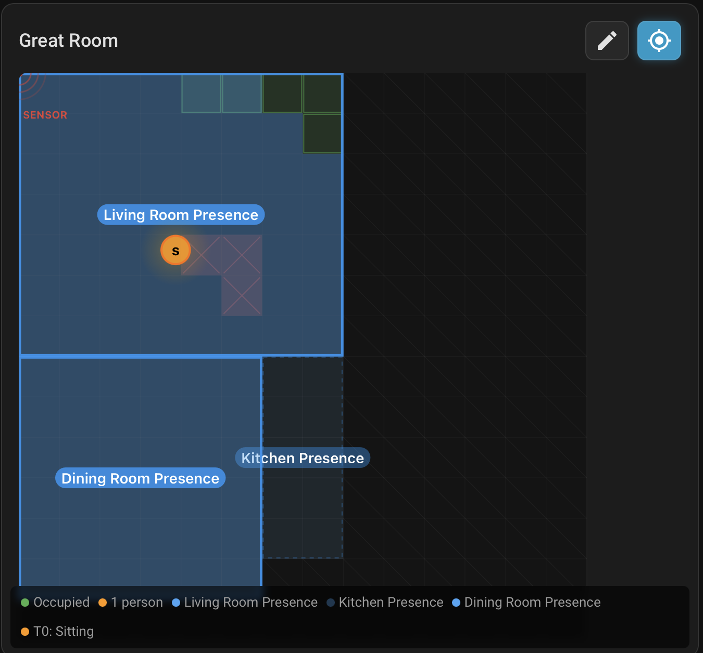
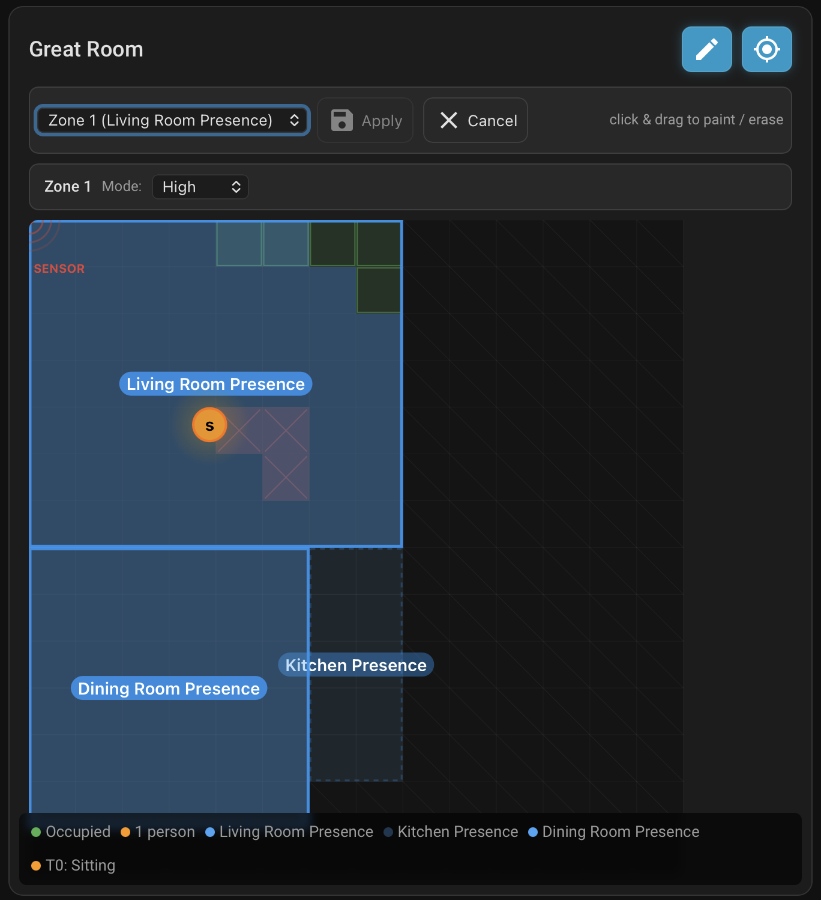
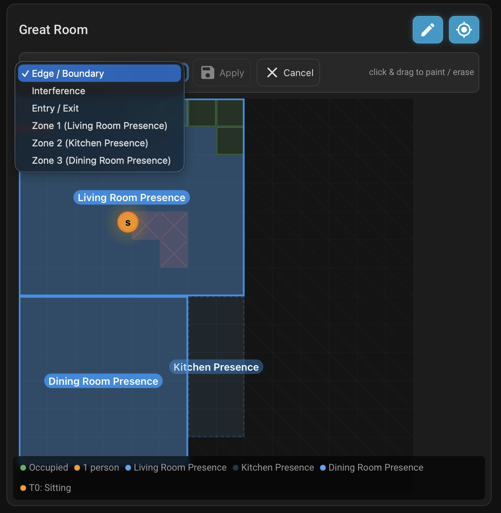
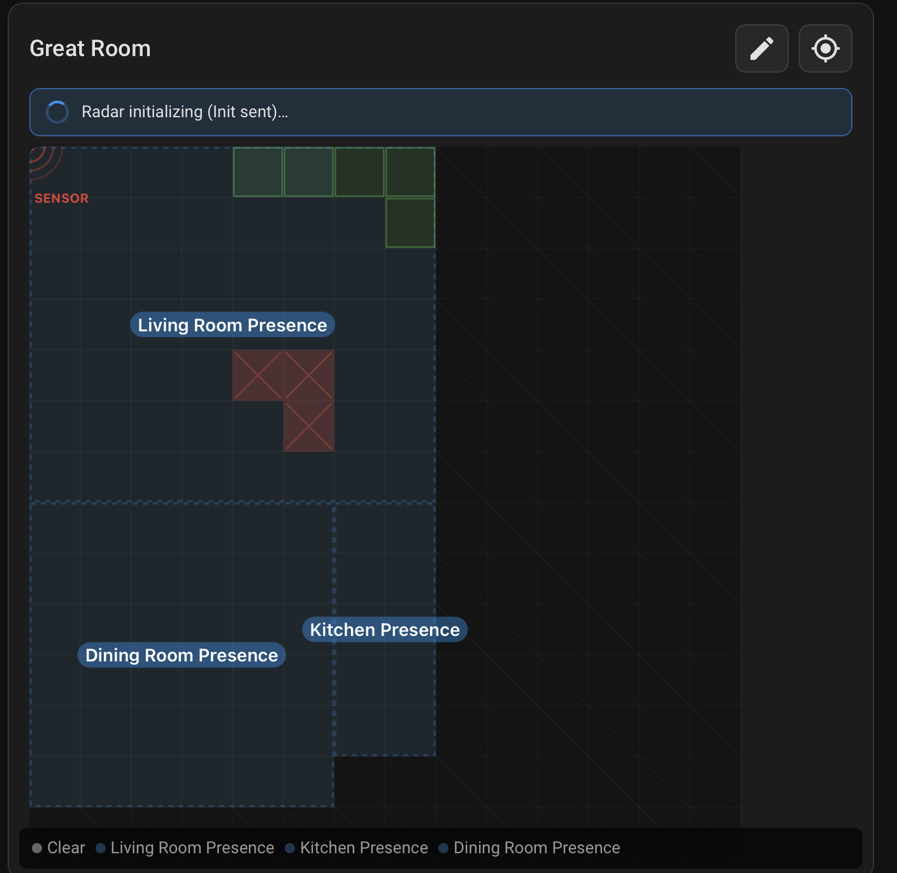
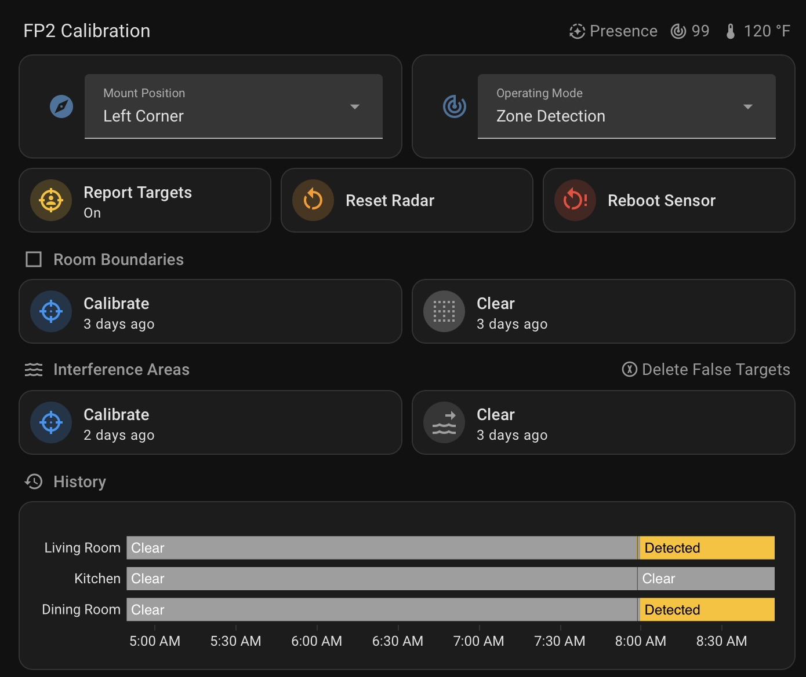

# Runtime Customization Fork

Work tracked on the `runtime-grids` branch of [jmlab-net/esphome_fp2_ng](https://github.com/jmlab-net/esphome_fp2_ng), forked from [JameZUK/esphome_fp2_ng](https://github.com/JameZUK/esphome_fp2_ng).

The goal: move zone, edge, interference, and entry/exit configuration out of compile-time YAML and into runtime-editable state, with a graphical paint UI in the Lovelace card and everything persisted to ESP flash.

---

## Contents

1. [Feature summary](#feature-summary)
2. [Changelog](#changelog)
3. [YAML reference](#yaml-reference)
4. [Home Assistant entities](#home-assistant-entities)
5. [ESPHome API actions](#esphome-api-actions)
6. [Lovelace card UI](#lovelace-card-ui)
7. [Screenshots](#screenshots)
8. [Dev workflow](#dev-workflow)

---

## Feature summary

| Layer | What changed from upstream |
|---|---|
| **Grids** (edge / interference / entry-exit / zone) | Now runtime-writable. 4 new ESPHome API actions (`set_edge_grid`, `set_interference_grid`, `set_entry_exit_grid`, `set_zone_grid`) accept the 56-char card hex and persist to ESP flash via `ESPPreferences`. Autoscan results from the existing Calibrate buttons also persist. Zone grids gated by an FNV-1a hash of the compiled zone defaults so YAML edits+reflash cleanly wipe stale runtime edits. |
| **Mount position** | New `select.aqara_fp2_mounting_position` entity. Changing it writes `WALL_CORNER_POS`, persists to flash, and triggers a full radar re-init. Compile-time `mounting_position:` still works as a first-boot default. |
| **Zones** | Per-zone runtime mode select (`Off` / `Low` / `Medium` / `High`) replaces compile-time `presence_sensitivity`. Off removes the zone from `ZONE_ACTIVATION_LIST` and pins count to 0; any level activates with the matching sensitivity. |
| **Calibration status** | Two new opt-in binary sensors (`calibrating_edge`, `calibrating_interference`) flip on during autoscan, off on completion or 60s timeout. Card surfaces them as an orange banner. |
| **Radar lifecycle** | `trigger_reset_radar()` now publishes `Booting` to `radar_state` immediately so the UI picks up the transition without lag. |
| **Lovelace card** | Previously read-only, now a full editor: pencil toggle, layer dropdown, click+drag paint, Apply/Cancel, zones panel with per-zone mode dropdown, prioritised status banner (offline/reinit/calibrating), auto-refetch on any watched sensor change. |

---

## Changelog

Card resource versions are bumped via `ha_config_set_dashboard_resource` so a hard-reload picks up each deploy without recompiling firmware. Backend commits require an **Install → Wirelessly** in the ESPHome dashboard.

### Card versions (`/hacsfiles/esphome_fp2_ng/card.js?v=runtime-grids-<N>`)

| Version | Backend commit(s) | Delta |
|---|---|---|
| `runtime-grids-1` | `80849e2`, `66bacc7` | Initial runtime grid editor — backend actions + pencil UI + paint drag + Apply/Cancel |
| `runtime-grids-2` | — | Cache-bust only (HACS URL had burned-in hacstag) |
| `runtime-grids-3` | `b3c9869` | Auto-refetch `mapConfig` when `mounting_position` entity changes |
| `runtime-grids-4` | `ce82686` | Removed mount dropdown (moved to secondary Lovelace card) + fixed SENSOR label clipping at corner mounts |
| `runtime-grids-5` | `0091f08` | Auto-refetch on grid-hex sensor changes (calibrate / clear / external edits all repaint card) |
| `runtime-grids-6` | `dbfbd62` | Calibration-in-progress indicators — orange banner with spinner |
| `runtime-grids-7` | `e4531c7` | Unified status banner — offline (red) / reinitializing (blue) / calibrating (orange) |
| `runtime-grids-8` | `93fa5e4` | Per-zone mode select (Off/Low/Med/High) + zones panel in edit mode |
| `runtime-grids-9` | `f9e5249` | Zones panel UX: single row for current zone only, stable DOM, no paint button |
| `runtime-grids-10` | `f2747d1` | Pending-value lock — mode dropdown no longer reverts during service call round-trip |
| `runtime-grids-11` | `94db1db` | Apply/Done unified button (superseded in -12) |
| `runtime-grids-12` | `8523d82` | Fix zone-mode entity lookup (uses `object_id` from backend), Apply/Cancel stay in edit mode, only pencil exits |

### Backend commits (full list)

See `git log upstream/main..runtime-grids`. Summary:

- `80849e2` — 4 grid-write API actions, ESPPreferences persistence, FNV-hash gated zone restore
- `4b9232f` — runtime mounting position select
- `dbfbd62` — calibration binary sensors + 60s timeout watchdog
- `e0891c2` — `radar_state: Booting` published on reset
- `93fa5e4` — per-zone mode select
- `8523d82` — `object_id` fields in `get_map_config` JSON

---

## YAML reference

### Minimal 3-zone configuration

```yaml
api:
  actions:
    # Existing — fetches grid state + metadata. Required by the card.
    - action: get_map_config
      supports_response: only
      then:
        - api.respond:
            data: !lambda |-
              id(fp2).json_get_map_data(root);

    # Runtime grid writes — called by the card's Apply button.
    - action: set_edge_grid
      variables: { grid_hex: string }
      supports_response: only
      then:
        - api.respond:
            data: !lambda |-
              id(fp2).api_set_edge_grid(grid_hex, root);
    - action: set_interference_grid
      variables: { grid_hex: string }
      supports_response: only
      then:
        - api.respond:
            data: !lambda |-
              id(fp2).api_set_interference_grid(grid_hex, root);
    - action: set_entry_exit_grid
      variables: { grid_hex: string }
      supports_response: only
      then:
        - api.respond:
            data: !lambda |-
              id(fp2).api_set_entry_exit_grid(grid_hex, root);
    - action: set_zone_grid
      variables: { zone_id: int, grid_hex: string }
      supports_response: only
      then:
        - api.respond:
            data: !lambda |-
              id(fp2).api_set_zone_grid(zone_id, grid_hex, root);

external_components:
  - source: github://jmlab-net/esphome_fp2_ng@runtime-grids
    refresh: 0s
    components: [aqara_fp2, aqara_fp2_accel]

aqara_fp2:
  id: fp2
  ...
  mounting_position: wall             # compile-time first-boot default
  mounting_position_select:
    name: "Mounting Position"          # runtime-editable (overrides above)

  # Opt-in grid-hex sensors — enables the card's auto-refetch on changes.
  edge_label_grid_sensor:
    name: "Edge Grid Hex"
  interference_grid_sensor:
    name: "Interference Grid Hex"
  entry_exit_grid_sensor:
    name: "Entry/Exit Grid Hex"

  # Calibration status indicators (drive the card's orange banner).
  calibrating_edge:
    name: "Calibrating Edge"
  calibrating_interference:
    name: "Calibrating Interference"

  zones:
    - id: zone_1
      grid: |-
        ..............
        ..............
        ..............
        ..XXXXXXXX....
        ..XXXXXXXX....
        ..XXXXXXXX....
        ..XXXXXXXX....
        ..XXXXXXXX....
        ..............
        ..............
        ..............
        ..............
        ..............
        ..............
      zone_people_count:
        name: "Zone 1 Count"
      mode:
        name: "Zone 1 Mode"
      # Optional add-backs — any subset of these lights up richer HA data:
      # presence:          { name: "Zone 1 Presence" }
      # motion:            { name: "Zone 1 Motion" }
      # posture:           { name: "Zone 1 Posture" }
      # zone_map_sensor:   { name: "Zone 1 Grid Hex" }

    - id: zone_2
      grid: |-
        (all dots — empty slot)
      zone_people_count:
        name: "Zone 2 Count"
      mode:
        name: "Zone 2 Mode"

    - id: zone_3
      grid: |-
        (all dots — empty slot)
      zone_people_count:
        name: "Zone 3 Count"
      mode:
        name: "Zone 3 Mode"
```

### New keys introduced by this fork

Under `aqara_fp2:` (top-level):

| Key | Type | Notes |
|---|---|---|
| `mounting_position_select` | select entity | Runtime-editable Wall / Left Corner / Right Corner. Triggers radar re-init on change. |
| `calibrating_edge` | binary_sensor | On during active edge autoscan. |
| `calibrating_interference` | binary_sensor | On during active interference autoscan. |

Under each `zones:[]` entry:

| Key | Type | Notes |
|---|---|---|
| `mode` | select entity | Off / Low / Medium / High. Off deactivates the zone; any level activates with the matching `ZONE_SENSITIVITY`. |
| `zone_people_count` | sensor | People count for the zone (unchanged — documenting for completeness). |
| `presence`, `motion`, `posture`, `zone_map_sensor` | optional | Pre-existing upstream options. Not required; card derives occupancy from `count > 0` if `presence` is absent. |

---

## Home Assistant entities

After install, the per-device entities are:

**Device-level (new):**
- `select.aqara_fp2_mounting_position`
- `binary_sensor.aqara_fp2_calibrating_edge`
- `binary_sensor.aqara_fp2_calibrating_interference`
- `sensor.aqara_fp2_edge_grid_hex`
- `sensor.aqara_fp2_interference_grid_hex`
- `sensor.aqara_fp2_entry_exit_grid_hex`

**Per zone (new):**
- `sensor.aqara_fp2_<zone_slug>_count`
- `select.aqara_fp2_<zone_slug>_mode`

`<zone_slug>` is the slugified form of the YAML sensor `name:` (e.g. `"Kitchen Count"` → `kitchen_count`). The card looks this up via `object_id` exposed in `get_map_config`, so naming is free-form.

**Upstream entities retained:** everything not listed above continues to work unchanged — `radar_state`, `total_people`, targets, operating_mode, calibrate / clear / reset / reboot buttons, accelerometer, light sensor, sleep vitals, fall detection, etc.

---

## ESPHome API actions

Called via `service: esphome.aqara_fp2_<action>` with `return_response: true`.

| Action | Input | Response |
|---|---|---|
| `get_map_config` | — | `{mounting_position, left_right_reverse, edge_grid?, interference_grid?, exit_grid?, zones:[{id, sensitivity, grid, presence_sensor?, presence_sensor_id?, count_id?, mode_id?}]}` |
| `set_edge_grid` | `{grid_hex: string(56)}` | `{ok: bool, error?: string}` |
| `set_interference_grid` | `{grid_hex: string(56)}` | `{ok: bool, error?: string}` |
| `set_entry_exit_grid` | `{grid_hex: string(56)}` | `{ok: bool, error?: string}` |
| `set_zone_grid` | `{zone_id: int, grid_hex: string(56)}` | `{ok: bool, error?: string}` |

**Hex format**: 14 rows × 2 bytes each (56 chars). Bit `(13 - col)` of each row's 16-bit value sets column `col`. Matches the `grid_to_hex_card_format` output.

---

## Lovelace card UI

Custom element: `<aqara-fp2-card>`. Deployed at `/config/www/community/esphome_fp2_ng/card.js`, registered as a HACS-managed resource.

### Read-only mode (default)

- Live radar view with grid, zones, targets, sensor marker.
- Presence / motion / people count status chips at the bottom.
- Top-right controls: **crosshair** (toggle Report Targets switch), **pencil** (enter edit mode).

### Edit mode (click the pencil)

A two-row toolbar appears:

1. **Layer dropdown**: `Edge / Boundary` · `Interference` · `Entry / Exit` · `Zone 1` · `Zone 2` · `Zone 3`
2. **Apply** · **Cancel** · dirty dot · hint text

Below the toolbar, when a **Zone N** is selected, a single-row **zones panel** shows:
- Zone N name
- Mode dropdown (`Off` / `Low` / `Medium` / `High`)

### Edit flow

- **Paint**: click and drag on the canvas. Paint or erase mode locks in on mousedown from the initial cell's prior value.
- **Apply**: commits the grid via the relevant `set_*_grid` action, refetches `get_map_config`, **stays in edit mode** (the committed grid becomes the new baseline).
- **Cancel**: discards pending grid edits for the current layer, **stays in edit mode**.
- **Pencil toggle** (off): exits edit mode entirely.

### Mode changes

Mode dropdown changes fire `select.select_option` directly — they commit immediately, independent of the Apply button. A pending-value lock prevents the dropdown from visually reverting during the round-trip.

### Status banner (above the canvas)

Priority order, highest wins:
1. **Red** — "Sensor offline — rebooting…" (radar_state entity missing / unavailable)
2. **Blue** — "Radar initializing (Booting / Init sent / Re-init)…"
3. **Orange** — "Calibrating room boundaries / interference / edge + interference…"
4. **Hidden** — normal operation

### Auto-refresh triggers

The card refetches `mapConfig` (debounced 500ms) whenever any of these HA entities change state:
- `select.<device>_mounting_position`
- `sensor.<device>_edge_grid_hex`
- `sensor.<device>_interference_grid_hex`
- `sensor.<device>_entry_exit_grid_hex`

So autoscans, clear-button presses, or edits from other HA clients all repaint the card automatically without a reload.

---

## Screenshots

### Card — read-only view
The card in normal live view: sensor marker in the top-left, painted edges, zone outlines with labels, and a detected target ("T0: Sitting").



### Card — edit mode, Zone N selected
Pencil active, layer dropdown on `Zone 1 (Living Room Presence)`, per-zone mode dropdown ("High"), and `Apply` / `Cancel` controls. Painted grid cells highlight the zone footprint.



### Card — layer selection while editing
Layer dropdown expanded showing the editable layers: `Edge / Boundary`, `Interference`, `Entry / Exit`, and each configured zone. Picking a layer scopes the paint/erase gesture to that grid.



### Status banner — reinitializing
Banner reads "Radar initializing (Init sent)…" right after a mount-position change or Reset Radar press. Grid is dimmed while the radar reboots.



### Secondary Lovelace card — FP2 Controls
Companion card: status badges (radar state / version / temperature), Report Targets + Reset Radar + Reboot Sensor row, inline Operating Mode + Mount Position selects, paired Calibrate/Clear actions for Room Boundaries and Interference Areas, Delete False Targets chip, and the presence history graph below.



---

## Dev workflow

### Remotes

```
origin    git@github.com:jmlab-net/esphome_fp2_ng.git    (this fork)
upstream  https://github.com/JameZUK/esphome_fp2_ng.git  (active upstream)
```

Active branch: `runtime-grids`. Keep `main` as a clean mirror of upstream:

```
git checkout main
git fetch upstream
git reset --hard upstream/main
git push origin main
```

Rebase at the start of each session:

```
git checkout runtime-grids
git fetch upstream
git rebase upstream/main
git push --force-with-lease origin runtime-grids
```

### Backend iteration (firmware changes)

1. Edit `components/aqara_fp2/*` on the local checkout
2. `git commit && git push origin claude/...:runtime-grids`
3. ESPHome dashboard → fp2 → **Install → Wirelessly**
4. First build pulls the new source from `@runtime-grids`, compiles, OTAs

### Card iteration (frontend changes)

Committing the change is the same. Deploy via scp to bypass HACS (HACS only tracks default-branch tips / release tags):

```bash
cat card.js | ssh -p 22 jon@192.168.0.11 \
  'sudo tee /config/www/community/esphome_fp2_ng/card.js >/dev/null'
```

Then bump the resource version query string to bust browser cache:

```
ha_config_set_dashboard_resource(
  resource_id="30609c71c833497b8e588eb97733ed7e",
  url="/hacsfiles/esphome_fp2_ng/card.js?v=runtime-grids-NNN",
)
```

Hard-reload the dashboard (Cmd/Ctrl+Shift+R) to pick up.

### Verification via MCP

Once a change ships, exercise it with:

```python
# Set a test pattern via the write action
ha_call_service("esphome", "aqara_fp2_set_edge_grid",
                data={"grid_hex": "3fff00003fff00003fff00003fff00003fff00003fff00003fff0000"},
                return_response=True)

# Read back
ha_call_service("esphome", "aqara_fp2_get_map_config", return_response=True)

# Reboot test for persistence
ha_call_service("button", "press", entity_id="button.aqara_fp2_reboot_sensor", wait=False)
# ... wait ~20s ...
ha_call_service("esphome", "aqara_fp2_get_map_config", return_response=True)
# Expect grid_hex to match pre-reboot value.
```

### When the ESPHome git clone cache gets stuck

Symptom: `could not set 'core.repositoryformatversion' to '0'` in the ESPHome dashboard during config validation.

Fix: restart the ESPHome Device Builder add-on from Settings → Add-ons. If that doesn't resolve it, try Clean Build Files from the device's three-dot menu.

---

## Open items

- **Zone-defaults hash** currently keys only on zone id + grid bytes. Changing a zone's `mode:` runtime default in YAML doesn't trigger a reset — runtime prefs win. Fine by design but worth documenting once we finalise.
- **Per-zone grid deactivation on mode→Off**: current behaviour retains the grid so reactivation restores the shape. Option to offer a "clear grid on deactivate" config flag if that turns out to be the common case.
- **Mount-position confirm dialog** was moved out of the card when we split controls into the secondary entities card — native HA select has no confirmation. Users now get immediate re-init on change. Worth deciding whether to add an HA blueprint that prompts before the change.
- **Upstream sync cadence.** Upstream is very active (15+ commits/day during the sleep/radar-OTA work). Rebasing monthly is probably fine; check for breaking changes in `fp2_component.h` enum `AttrId` and the UART protocol handlers.
